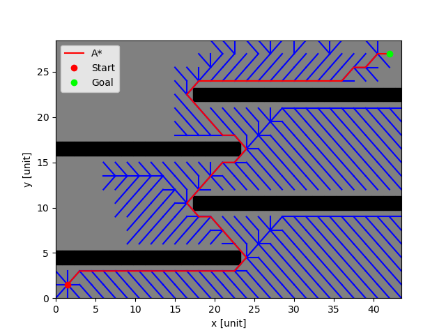

# Search Algorithms

A collection of classical search algorithms implemented in modern C++.

This project is intended for:
- learning and educational purposes,
- algorithm visualization and experimentation,
- benchmarking and comparison of search strategies,
- reusable reference implementations.

---

## Features

Currently implemented / planned algorithms may include:

- Breadth-First Search (BFS)
- Depth-First Search (DFS)
- Dijkstra
- A*
- Greedy Best-First Search
- Bidirectional Search
- Flood Fill
- Heuristic-based pathfinding

Additional algorithms and optimizations may be added over time.

---

## Project Goals

The main goals of this repository are:

- clean and understandable implementations,
- modern C++ design,
- extensibility for experimentation,
- educational readability,
- fun

---

## Requirements

### Compiler

A C++20 compatible compiler is recommended.

- G++ 13.3+ recommended
- Clang 17+ or MSVC 2022+ may also work

### Build System

- CMake 3.20 or newer recommended

---

## Project Structure

```text
search_algorithms/
├── inc/            # Public headers
├── src/            # Source files
├── unit_tests/     # Unit tests
├── testing/        # Execution of algorithms
├── docs/           # Documentation
├── build/          # Build output (generated)
├── compile.sh      # Compile everything easily
├── Doxyfile        # Generate documentation
└── CMakeLists.txt  # Building everything
```

---

## Disclaimer

This software is provided for educational and experimental purposes.

THE SOFTWARE IS PROVIDED "AS IS", WITHOUT WARRANTY OF ANY KIND,
EXPRESS OR IMPLIED, INCLUDING BUT NOT LIMITED TO THE WARRANTIES
OF MERCHANTABILITY, FITNESS FOR A PARTICULAR PURPOSE AND
NONINFRINGEMENT.

Use at your own risk.

---

## License

MIT license, see LICENSE file.

---

## Contributing

Contributions, issues, and suggestions are welcome.

Please ensure:

- readable code,
- consistent formatting,
- reasonable documentation,
- successful compilation before submitting changes.

---

## Author

Created and maintained by Christoph Kolhoff.

---

## Citation

If you use this software in academic work, publications, technical reports, theses, or patents, please cite the repository like:
Kolhoff, C. Search Algorithms. GitHub repository. Available at: https://github.com/chk1990/search_algorithms

## BibTeX
```text
@software{kolhoff_search_algorithms,
         author = {Christoph Kolhoff},
         title = {Search Algorithms},
         year = {2026},
         publisher = {GitHub},
         url = {https://github.com/chk1990/search_algorithms}
}
```
If a specific release is used, citing the corresponding version or commit hash is recommended to ensure reproducibility.

---

# Visualization
To visualize the path search the Python script in the top folder can be used. It delivers images like below:
